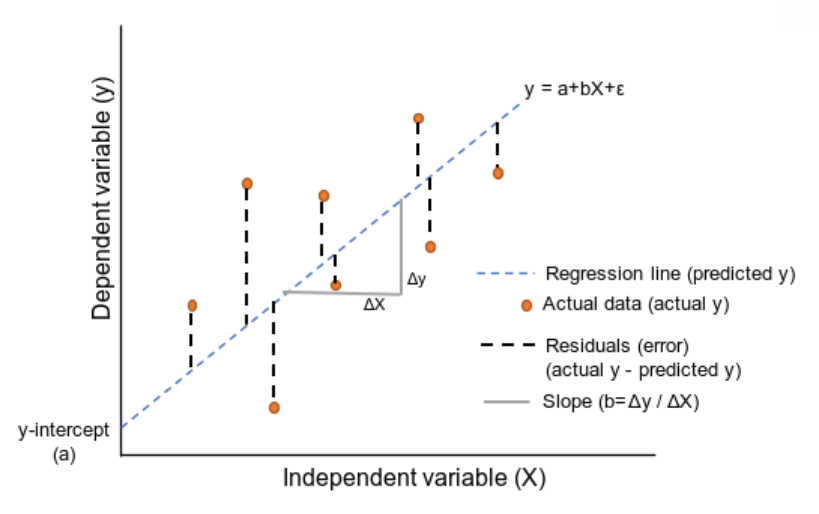

# Linear Regression Model

Linear Regression is one of the simplest and most widely used algorithms for predictive modeling. It aims to establish a relationship between a dependent variable (target) and one or more independent variables (features) by fitting a linear equation to observed data. Linear regression is used when we want to predict a continuous value, such as predicting house prices, stock prices, or sales forecasts based on historical data.

## Linear Regression Model Equation

The basic Linear Regression equation is: \( F(x) = mx + c = y \) (predicted output)


Where:
- `F(x)` is the regression model’s predicted output.
- `m` is the slope.
- `x` is the independent variable.
- `c` is the intercept (also called `a`).

This model can also be expressed as:

$$
y = a + bX + \varepsilon
$$

Where:
- $y$ is the dependent (predicted) variable  
- $a$ is the intercept (bias term)  
- $b$ is the slope (coefficient)  
- $X$ is the independent variable  
- $\varepsilon$ is the error (residual) term

## Regression Diagram

### Explanation of the Diagram:

- **Regression Line (Blue Dashed Line)**: The predicted values from the equation `y = a + bX` that best fit the data points.
- **Actual Data Points (Orange Dots)**: The real observed values of `y` for each `x`, which may not lie on the regression line due to errors.
- **Residuals (Black Dashed Lines)**: The vertical distance between each data point and the regression line, showing the error in prediction. Smaller residuals indicate a better fit.
- **Slope (Gray Line)**: The rate of change of `y` with respect to `x`, showing how much `y` changes for each unit change in `x`. It’s calculated as `b = Δy / Δx`.

Formula (`y = a + bX + ε`):

Where:
- `y` is the predicted value.
- `a` is the intercept.
- `b` is the slope.
- `X` is the independent variable.
- `ε` is the error term.

## Model Parameters

In multiple linear regression, the model is expressed as:

$$
y = \sum_{j=1}^{D} w_j x_j + \varepsilon
$$

Where:
- $y$ : predicted (dependent) variable  
- $x_j$ : $j$-th independent feature  
- $w_j$ : weight (coefficient) for feature $x_j$  
- $D$ : total number of features  
- $\varepsilon$ : error (residual) term  

The set of model parameters is defined as:

$$
\boldsymbol{\theta} = \{ w_0, w_1, w_2, \dots, w_D, \sigma \}
$$

Where:
- $w_0$ : intercept (bias term)  
- $w_1, w_2, \dots, w_D$ : weights (coefficients) of the model  
- $\sigma$ : standard deviation of the error term  

Alternatively, the parameter vector can be written as:

$$
\boldsymbol{\theta} = \{ \mathbf{w}, \sigma \}
$$

Where:
- $\mathbf{w} = (w_0, w_1, \dots, w_D)^T$ is the weight vector

## Linear Regression – Mathematical Concepts

Linear Regression is one of the simplest and most widely used algorithms in machine learning. It models the relationship between a dependent variable and one or more independent variables by fitting a straight line (in the case of simple linear regression) or a hyperplane (in the case of multiple linear regression). This section walks through the key mathematical concepts behind Linear Regression.

---

### 1. Regression Equation

The core equation of simple linear regression is:

$$
y = mx + c
$$

Where:
- $y$ : predicted (dependent) variable  
- $x$ : independent variable  
- $m$ : slope (coefficient)  
- $c$ : intercept (bias term)

This equation represents the relationship between the independent variable $x$ and the dependent variable $y$.

---

### 2. Formula for Slope ($m$)

The slope of the best-fit line is calculated as:

$$
m = \frac{N\sum (x_i y_i) - \left(\sum x_i\right)\left(\sum y_i\right)}
{N\sum (x_i^2) - \left(\sum x_i\right)^2}
$$

Where:
- $N$ : number of observations  
- $x_i$ : $i$-th observation of the independent variable  
- $y_i$ : $i$-th observation of the dependent variable  

---

### 3. Formula for Intercept ($c$)

After calculating the slope, the intercept is computed as:

$$
c = \bar{y} - m\bar{x}
$$

Where:
- $\bar{x}$ : mean of the independent variable  
- $\bar{y}$ : mean of the dependent variable  

---

### 4. Example Calculation

Consider the following dataset:

| $x$ | $y$ |
|----|----|
| 1  | 2  |
| 2  | 3  |
| 3  | 5  |
| 4  | 4  |

**Steps:**
1. Compute $\sum x_i$, $\sum y_i$, $\sum x_i y_i$, $\sum x_i^2$  
2. Apply the slope and intercept formulas to obtain the regression line  

---

### 5. Final Regression Equation

Using the computed values of $m$ and $c$, the prediction equation becomes:

$$
\hat{y} = mx + c
$$

Where:
- $\hat{y}$ : predicted value of the dependent variable  

---

### Multiple Linear Regression (Multiple Features)

When there are multiple independent variables, the model becomes:

$$
y = \sum_{j=1}^{D} w_j x_j + w_0
$$

Where:
- $x_j$ : $j$-th independent feature  
- $w_j$ : coefficient (slope) of feature $x_j$  
- $w_0$ : intercept (bias term)  
- $D$ : total number of features  

This model predicts $y$ using multiple features.

---

### Formula for Multiple Linear Regression (Matrix Form)

The optimal parameters are computed using the Normal Equation:

$$
\mathbf{w} = \left(X^T X\right)^{-1} X^T \mathbf{y}
$$

Where:
- $X$ : feature matrix  
- $\mathbf{y}$ : target (output) vector  
- $\mathbf{w}$ : weight vector (including intercept)

This equation allows us to compute the best-fit values for multiple independent variables.

## Python Implementation for Multiple Linear Regression

Here’s an example Python implementation to perform Multiple Linear Regression using the dataset with two features:

```python
import numpy as np
import pandas as pd

# Sample dataset with two independent variables
data = {'X1': [1, 2, 3, 4], 'X2': [2, 3, 5, 4], 'Y': [2, 3, 5, 4]}
df = pd.DataFrame(data)

# Step 1: Add a column of 1s for the intercept (c)
X = df[['X1', 'X2']]
X = np.c_[np.ones(X.shape[0]), X]  # Adding a column for the intercept (c)

y = df['Y']

# Step 2: Calculate the parameters using the Normal Equation
X_T = X.T
w = np.linalg.inv(X_T.dot(X)).dot(X_T).dot(y)

# Step 3: Display the weights (slope for each feature, and intercept)
intercept = w[0]
slope_1 = w[1]
slope_2 = w[2]

print(f"Intercept (c): {intercept}")
print(f"Slope for X1: {slope_1}")
print(f"Slope for X2: {slope_2}")

# Step 4: Make a prediction
x_new = np.array([1, 5, 6])  # Example: X1=5, X2=6
y_predict = np.dot(x_new, w)

print(f"Predicted value: {y_predict}")
